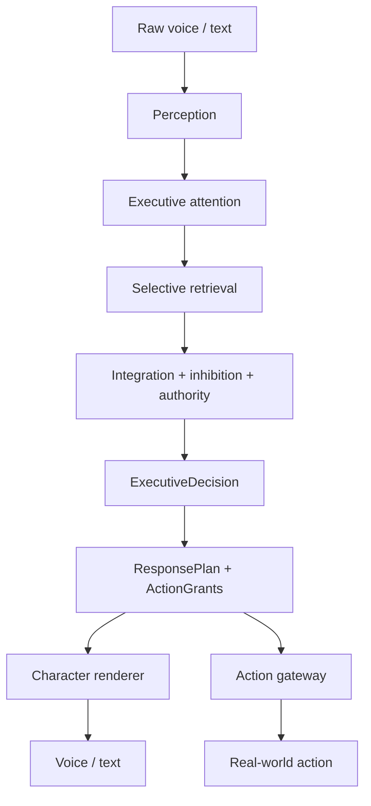
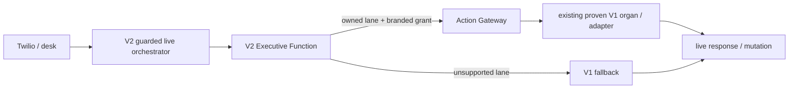

> **LEGACY DAYFORGE COMPATIBILITY:** Retained historical literals in this file are compatibility/history only; they are not current architecture. See docs/legacy/LEGACY_DAYFORGE_COMPATIBILITY.md.

# Claire Brain V2

Canonical architecture for replacing Claire’s **cognitive control plane**.

This document constrains Brain V2 work. Implementation lives under `server/claire/brain/`. Live status lives in `server/claire/brain/STATUS.md`. Session handoff lives in `docs/claire-brain-v2-handoff.md`.

**Adam explicitly authorized the guarded production cutover on 2026-09-25. Stage C is operator-scoped and flag-gated; this is not blanket authority for every V2 lane.**

---

## 1. Why V2 exists

Claire already has functioning organs: voice transport, business truth, provenance, conversation memory, relationship/canon, Day Line actions, and a distinctive voice.

She does **not** have a single executive mind.

Today several systems independently interpret an utterance, choose a route, mint action authority, or hang up. Execution order decides the winner. That produced the production failures:

- factual questions becoming Day Line work
- pending state hijacking a new turn
- “Dana Tuesday” becoming a name
- the global board contaminating a scoped question
- ordered-query continuation losing what was actually spoken
- historical memory spoken as present truth
- action-like text becoming action authority
- personal/narrative state interfering with business behavior

PR #191 and PR #192 tried to strangler-migrate `runClaireTurn()` into a kernel. Useful pieces came out of that. The architectural destination did not: the mega-orchestrator remained the brain.

V2 does not make Claire “smarter” by adding more rules. It changes her from **many systems competing to decide** into **many specialized faculties feeding one executive mind**.

---

## 2. Governing invariant

```
EVERYTHING MAY INFORM.
ONLY EXECUTIVE FUNCTION MAY DECIDE.
```

Executive Function is the only sovereign decision-maker for:

- what Claire believes **for this turn**
- what she says
- what she proposes
- what she mutates
- whether the call ends

No reader, parser, pending object, rapport band, proactive board, or model reply may decide those things on its own.

Model output is **not** authority. Model-assisted cognition sits **inside** deterministic governance.

---

## 3. Do not rewrite Claire from scratch

Keep the body. Replace the control plane.

| Keep | Replace |
|---|---|
| Business truth readers | `runClaireTurn()` as the mind |
| Provenance / claim receipts | Competing interpreters as authorities |
| Conversation ledger | Pre-turn hangup grammar as a second control plane |
| Progression / canon / rapport | `decideClaireAnswerRoute` as top-level intent |
| Day Director / briefing commit / follow-up commit | Action services interpreting raw speech |
| Twilio / TTS / transcript log | PR #192’s string-then-label ResponsePlan |

Stage C keeps the existing body while moving selected decisions to V2. `runClaireBrainV2LiveTurn` runs before the legacy adapter on guarded live lanes. V1 services remain reusable organs/adapters and fallback for lanes V2 does not yet own; they are retired only in Phase J.

`runClaireBrainTurn` remains shadow by default. `CLAIRE_BRAIN_V2_LIVE=1` explicitly enables the operator-scoped guarded path.

---

## 4. Cognitive pipeline



Perception decides whether a complete thought exists. Executive Function never receives a half-turn unless the continuation safety limit forces a flush.

The renderer phrases. It does not think.

Action adapters execute grants. They do not interpret.

---

## 5. Compartment model

Do **not** create a second database per metaphor. Map existing stores into adapters.

### Perception

What was said? Is the thought complete?

Wraps:

- `server/claire/turn/interpretTurn.ts` (fields, not sovereignty)
- `shouldHoldForContinuation` / `pendingFragment` / `providerFragments`
- `server/claire/turn/dialogueAct.ts` (informs; does not route)
- Twilio ASR pieces in `claireTwilio.ts`

### Working Memory

Current thread, not long-term storage.

Wraps `ClaireTurnState` / `ClaireAnalyticsState`:

- pending briefing / proposal / account follow-up
- ordered query cursor (result ids ≠ presented ids)
- prior-claim receipts
- focus account
- fragment state
- coverage subjects
- current-call context

Pending state answers “what is ‘yes’ referring to?” It does **not** answer “what does this new utterance mean?”

### Business Memory

Authoritative current business truth.

Wraps, does not reimplement:

- `server/analytics/businessQuery.ts`
- `server/analytics/paidOrderLedger.ts`
- `server/analytics/sourceBindings.ts`
- `server/claire/knowledge/accountKnowledge.ts`
- `server/claire/knowledge/operationsKnowledge.ts`
- `server/claire/knowledge/openOrdersKnowledge.ts`
- `server/claire/knowledge/encyclopediaAgent.ts` (retrieval only)
- Field Today / LegacyDayforge commercial joins
- PR #192 `sourceVisibility` provenance filter (to be ported)

### Episodic Memory

What was said or recorded **then**.

Wraps:

- `server/claire/conversation/ledgerService.ts`
- `server/claire/knowledge/conversationMemory.ts`
- visit outcomes / field notes
- prior actions

**Law:** episodic evidence proves “Adam said X” or “X was recorded then.” It does **not** automatically prove X is currently true.

### Self / Social Memory

Who Claire is, and what she may disclose.

Wraps:

- `server/claire/character/*` (canon, compiler, personality lock, relationship)
- `server/claire/progression/*` (policy, entitlements, personal controller)
- `claire_personal_ledger`

May affect tone and personal disclosure. May **never** manufacture, suppress, or change business truth.

### Goals / Planning

What might be worth doing.

Wraps:

- `macroGoalService.ts`
- `campaignAwareness.ts`
- `workdayPlanService.ts`
- proactive board **inputs** (`boardService.ts` as evidence, not as a router)

Goals may recommend. They may not perform actions. A global goal may not contaminate a scoped Dana question.

### Action systems

Execute. Do not interpret.

Wraps:

- Day Director
- `briefingCommit.ts` / `reviseBriefing.ts`
- `accountActions.ts` commit path
- `voiceCommitmentLoop.ts` as **executor of grants**, not as a speech interpreter
- future messaging

A mutation requires an `ExecutiveActionGrant`. Seeing action-like text is not a grant.

### Character renderer

Phrases an already-decided `ResponsePlan`.

Wraps:

- `businessSpeech.ts` (deterministic numbers)
- `preDriveConversation.ts` generation **after** a plan exists
- personality lock / character compiler
- assertion guard as a post-render safety lint — not as the planner

The renderer may phrase, compress, and keep Claire’s voice. It may **not** add facts, invent numbers, grant authority, add actions, decide disclosure, change call control, or change a recommendation’s meaning.

### Transport

Unchanged I/O.

- `claireTwilio.ts`
- `claireRouter.ts`
- `xaiTts.ts`
- transcript log (`default:adam-admin` scope unchanged)

Transport currently **does** hang up before `runClaireTurn` via `shouldEndClaireCallOnUtterance`. That is old control plane. V2 call-end is an executive grant. Transport must eventually only honor `ExecutiveDecision.callControl`. Until cutover, V1 keep its current hangup behavior so production does not change.

---

## 6. Old control plane to retire (after cutover)

These remain in production as V1 until Phase J.

| Site | File | Why it is control-plane, not organ |
|---|---|---|
| Mega-orchestrator | `turn/claireTurn.ts` `runClaireTurn` | Interprets, routes, proposes, answers, hangs up |
| Answer-path chooser as top-level intent | `answerRouter.ts` `decideClaireAnswerRoute` | Fine **inside** a selected business lane; not a mind |
| Second business interpreter | `businessConversation.ts` `parseBusinessTurn` | Re-decides what Adam meant |
| Voice work classifier | `voiceCommitmentLoop.ts` `classifyVoiceWorkStatement` | Independent speech interpreter |
| Duplicate yes/no | `detectConfirmation` vs `replyDecision` | Two confirm planes |
| Pre-turn hangup | `preDriveConversation.ts` `shouldEndClaireCallOnUtterance` | Hangs up before the kernel |
| Conservative regex follow-up | `conservativeClaireFollowUp` | Competing route |
| Open-dialogue-act as authority | `turn/dialogueAct.ts` | Informs; currently gates briefing |
| Shared heuristics | `shared/claireRuntime.ts` | Parallel meaning |
| Topic/mode detectors as routers | `topicDetection.ts` | Personal vs business routing |
| Proactive board as top-level answer | `boardService.ts` `ensureAdamBoard` | Organ is fine; unsolicited routing is not |
| PR #192 decorative plan | `planFromSpeak` after final string | Labels speech; does not author it |

`interpretTurn` is a **perception organ**, not the executive. Keep the type/fields. Do not treat it as sovereignty.

---

## 7. Executive Function

Not one giant LLM. Model-assisted cognition inside a deterministic governor.

### 7.1 Attention

From `PerceivedTurn` + working memory, decide:

- what is relevant
- which compartments to consult
- which memories **not** to retrieve
- whether this is business, action, personal, narrative, conversation, call control, or several at once

### 7.2 Retrieval requests

Typed requests only. Compartments return `EvidenceItem[]`. They do not decide the response.

### 7.3 Integration

Combine utterance, working memory, authoritative business evidence, history, goals, and personal permissions. Resolve conflicts.

### 7.4 Inhibition (critical)

Executive Function must explicitly block invalid cognition:

| Invalid leap | Inhibit |
|---|---|
| Historical claim → current truth | Require Business Memory / fresh reread |
| Parser found task-like text → action authority | Require `explicitActionRequest` or `operatorWorkCommitment` |
| Pending proposal → meaning of this utterance | Pending only binds yes/no/revise |
| Rapport → suppress business facts | Never |
| Prior receipt → “are you sure?” still true | Fresh reread if recheckable |
| Recommendation → execute it | Separate grant |
| Personal/narrative lane → withhold business | Never |
| Global goal → contaminate scoped Dana | Board only on broad briefing |
| Model-generated statement → evidence | Never |

Inhibited candidates are recorded on `ExecutiveDecision.inhibitedCandidates`.

### 7.5 Authority

Only Executive Function issues:

- read-only answer
- business judgment (non-mutative)
- proposal permission
- mutation permission (`ExecutiveActionGrant`)
- personal disclosure permission
- narrative reveal permission
- call termination permission

### 7.6 Final decision

Exactly one `ExecutiveDecision` per completed turn.

---

## 8. Authority contracts (TypeScript must make bypass hard)

| Output | Required basis |
|---|---|
| `BusinessFactSegment` | one or more `EvidenceRef`s whose `authoritativeFor` includes `current_business_truth` or a named reader |
| Fresh correctness confirmation | `PriorClaimRecheckResult` with `resolution: "fresh_query"` when the receipt is recheckable |
| Provenance-only (“where did that number come from?”) | existing receipt may answer; that is **not** “still true now” |
| `ActionProposalSegment` | `ExecutiveActionGrant` with class `propose_*` |
| `ActionConfirmationSegment` | grant + mutation receipts from the action adapter |
| Real mutation | grant with class `commit_*` / `cancel_*` presented to the action gateway |
| `PersonalDisclosureSegment` | progression entitlement / authorization basis |
| `CallControlSegment` with `endCall: true` | `CallControlGrant` |
| `BusinessJudgmentSegment` | evidence in, `mutationAuthority: false` on the segment, no grant |

Factories for grants live only in `server/claire/brain/executive/`. Downstream adapters accept grants; they cannot mint them.

---

## 9. Core contracts

Defined in `server/claire/brain/contracts/`.

Conceptual shapes (names may gain fields; they may not lose the concepts):

**PerceivedTurn** — completeness, dialogue acts, business intent, entities, temporal references, cardinality, ordering, exclusions, prior-query reference, correction/target, refusal, acknowledgement, explicit action request, operator work commitment, personal/narrative probes, call control, ambiguities.

**WorkingMemorySnapshot** — thread, focus entities, pending proposal/briefing, ordered query (resolved vs presented), prior claim, unresolved references, current call context.

**EvidenceItem** — type, source, provenance, observedAt, asOf, freshness, coverage, `authoritativeFor`, payload.

**ExecutiveActionGrant** — actionClass, scope, authorityBasis, sourceTurn, expiration, constraints. Branded; not a boolean.

**ExecutiveDecision** — perceivedTurn, attention, retrievals, evidence, conclusions, inhibitedCandidates, responseSegments, actionGrants, callControl.

**ResponsePlan** — typed segments **before** spoken prose. The renderer consumes the plan. It does not reverse-engineer the plan from prose.

Unlike PR #192: there is no `planFromSpeak` in the V2 control plane.

---

## 10. Truth / provenance invariants that must survive

From `docs/goldline/CLAIRE_TRUTH_PROVENANCE.md` and the source-binding work:

- unknown/unbound data cannot become `$0`
- partial coverage cannot be presented as exhaustive
- later sync timestamps cannot fabricate earlier coverage
- orders-created coverage cannot fabricate payment-event completeness
- CleanCloud / GUMBALL coverage semantics remain distinct
- semantic gaps remain explicit
- business facts survive personal/narrative subsystem failure
- personal/narrative failure fails closed
- mutation receipts are distinct from factual evidence
- history is not current truth
- model confidence is not evidence
- narrative state cannot grant action authority
- “Where did that number come from?” may use existing provenance
- “Are you sure?” / “Check again.” requires a fresh authoritative reread if recheckable
- a receipt identifies **what** to recheck; it is not proof the claim still holds
- judgment/advice is not a factual claim (`assertsFact === false`)
- fail closed: timeout/error → unverifiable, never a confession of lying

Do not regress source-binding / coverage.

---

## 11. Ordered query memory

Working Memory must store:

- query parameters
- requested cardinality
- ordering
- anchor
- exclusions (this query thread only)
- result identity / resolved member ids
- presented member ids
- cursor/continuation state

If the query resolved five sales and Claire presented only Thomas:

- `resolvedIds` = five
- `presentedIds` = Thomas

“The other four” returns the remaining four of **that** result. Not records 6–9.

A new unrelated query resets exclusions.

PR #192's `OrderedQueryCursor` (`resolved` vs `presented`) is the piece to port. Do not port "delivered = entire query window."

**Implemented** in `server/claire/brain/workingMemory/orderedQuery.ts`. The memory also
retains `sourceEvidence`: the evidence item that licensed the result. A continuation
re-cites that same item, so "the other four" carries the original read's as-of time — it
is the same read, a different slice, never a fresh claim about now.

---

## 11a. Identity resolution comes from rows, never from string shape

Perception emits an ENTITY MENTION. It does not decide whether that mention is a person
or an account.

A one-word mention is not necessarily a contact ("Ravenswood") and a multi-word mention
is not necessarily an account ("Marcus Bell"). Any whitespace-based rule is wrong in both
directions, so there is none. `businessMemory/entityResolution.ts` resolves a mention
against authoritative account rows and contact rows; where rows cannot settle it, the
resolution is `ambiguous` or `unknown` and carries no current-truth authority — a reason
to ask, not a reason to assert.

## 12. Entity / temporal / account resolution

Keep reusable contact → account resolution (PR #192 `contactAccountResolution.ts`).

“What should I do about Dana Tuesday?”

```
contact = Dana
account = The Louise iff an authoritative contact row says so
temporal = Tuesday
intent = business judgment
action authority = none
```

Then retrieve scoped evidence and produce a useful judgment. Do not search “Dana Tuesday.” Do not invoke the global board. Do not create work.

“I need to call Dana Tuesday.” — same resolution, plus operator work commitment → may mint a **proposal** grant, still no mutation until confirm.

---

## 13. Business judgment

Fact: “What happened with Dana?”
Judgment: “What should I do about Dana?”

Judgment:

1. retrieve authoritative current state
2. optionally retrieve relevant history (labeled historical)
3. consult goals when relevant
4. let the model synthesize a recommendation **over evidence**
5. keep the recommendation non-mutative
6. prevent unsupported facts from entering the recommendation

This is where model reasoning belongs. The model may not manufacture evidence.

---

## 14. Pending-state lifecycle

| Operator | Disposition |
|---|---|
| “No.” | reject + clear |
| “Actually don’t do that.” | remains cleared; acknowledge |
| “No, Wednesday.” | revise existing item if valid; proposal authority inherited from pending lifecycle, not manufactured |
| “Forget that. What were my last five sales?” | supersede and route business |
| Unrelated new turn | pending does not reinterpret meaning; it may be reminded at most once per item identity |
| Substantive new topic, attention repair, or mission declaration | **dormant + suppress**. Remembered. Not rejected, not deleted, not committed. It cannot speak or act on that turn |
| “No. I’m telling you I have a mission…” / “No. Listen to me.” | not a pending refusal. Attention repair / task switch wins |
| “What about that stop?” when the words match the held item | reactivates the dormant item. Does not confirm it |

Dormant is not rejected, not deleted, and not committed. Bare “No.” still rejects and clears. “No, Wednesday.” still revises.

---

## 14a. Executive task switching and mission intent

Motivating failure: the production Claire call that opened around 2026-09-22 08:50 AM PDT
(conversation `b9938fe9-ae81-4500-a535-223fcea3fbe7`). After a stale pending stop confirmation,
the operator moved to publishing an ad and then said it was today’s mission. Live V1 treated
the continuation as the old yes/no, then treated attention repair and the operator’s own
intention as unverifiable. Brain V2’s shadow cognition for that sequence is the regression in
`server/claire/brain/tests/fixtures/executiveCallSequence.ts`. It is hermetic. It does not read
production.

```
EVERYTHING MAY INFORM.
ONLY EXECUTIVE FUNCTION MAY DECIDE.
```

Perception describes a bounded work frame. Executive Function decides. The frame kind is not a grant.

| Declaration | What V2 may do |
|---|---|
| Ordinary first-person plan (“I need to call Dana Tuesday.”) | May propose Day Line. Still no live mutation |
| Explicit Day Line (“Put that on my Day Line.”) | Existing `propose_day_line` proposal |
| Imperative or other explicit action (“Call Dana.”, “remind me to…”) | Recognized. No Day Line grant. No invented sender, caller, or reminder |
| Strategic / mission (“My mission today is …”, “considered as my mission”) | Cognitive frame only. No Day Line proposal |
| Context narration (“I’m heading home.”, “I need you to know…”) | No mutation proposal |
| “Make that today’s mission.” | Understand it. **No canonical mission write exists**, so no action class is minted and nothing falls back to Day Line |

There is no `propose_daily_mission` action. Mission Director, WeeklyIntent, Daily Command, and
Narrator are different authorities. Understanding “today’s mission” does not lock, assign,
complete, or narrate any of them, and it does not commit the Day Line.

Operator-attested intention (“I have to post an ad”) is not an external fact and is not sent
through prior-claim verification. An embedded external claim (“because they owe me $10,000”)
stays unverified and does not erase the intention.

Attention repair is only a meta-conversational signal (“Listen to me.”, “You’re not listening.”,
“That’s not what I’m saying.”). “I’m telling you…” and “I need you to know…” introduce context
or a mission. They are not attention repair by themselves. Repair is not
`prior_claim_challenge`, not `correctness_challenge`, and not verification. It cannot mint a
grant by itself, and it cannot erase an explicit “don’t add / don’t log / don’t schedule.”
“Are you sure?” and “Where did that number come from?” still do.

An open fragment (“I want this …”) is incomplete. It mints nothing. A continuation that
supplies the role (“considered as my mission today”) joins it. Dormant pending work cannot
speak between the two pieces.

The strategic frame lives in V2 working memory as `activeWorkFrame` with
`durability: "cognitive_only"`. It stores a closed `kind` (`publish`, `contact`,
`field_movement`, `unspecified`) and a synthetic `sourceTraceRef`
(`trace:<conversationKey>#<ms>`). That value is a shadow decision trace. It is not a
conversation-ledger turn id, and nothing resolves it back to the utterance. The frame does
not store operator prose. Remembered is not active: an unrelated sales question leaves the
frame in memory, sets the `strategic_frame` slot to dormant and suppressed, and does not put
`strategic_work` on `activeTaskSets`. An explicit return to the mission, or a later intention
that continues that same frame, reactivates it. A first-person ordinary plan such as
“I need to call Dana Tuesday.” can still propose Day Line without deleting the mission.
An imperative (“Call Dana.”, “Email Dana.”) does not.

Explicit goodbye (“Bye.”, “Talk later.”, “Hang up.”, “I have to go.”) ends the call even when
a dollar amount is in the same utterance. “go” followed by a destination or work complement
(“go home”, “go pick up the order”, “go there”, “go back”) is movement or work, not
leave-taking. A temporal modifier of the departure itself (“go now”, “go soon”, “go for now”)
stays leave-taking. Explicit goodbye still wins over a complement. An embedded fact cannot
cancel a goodbye.

“Text me that.” is the existing operator-artifact SMS capability. Brain V2 recognizes it and
mints no grant. It is not a Day Line proposal.

The work-frame classifier returns `classified`, `unknown`, or `failed`. Unknown and failed
hold. They do not propose Day Line and they do not change the strategic frame. Model text is
not authority. Only `executive/grants.ts` mints branded grants. Shadow grants remain
`mutationAllowed: false` and `shadowOnly: true`. On the explicitly enabled Stage C path,
the executive may mint `mutationAllowed: true, shadowOnly: false` grants for live lanes
it owns; the Action Gateway is the only execution boundary.

Shadow comparison records the work-frame kind, attention repair, operator-intent and
external-fact flags, classifier status, suppressed slots, whether verification ran, and
cognitive-acknowledgement kinds. It does not copy the utterance.

ResponsePlan uses `CognitiveAcknowledgementSegment` with `durableWrite: false`. That segment
cannot carry a grant. Its wording may confirm understanding. It must not claim the work was
locked, committed, added, logged, saved, or made today’s mission.

Stage C was explicitly authorized on 2026-09-25. The current guarded scope is Day Line
work lifecycle plus call control. Existing V1 code may still execute the proven mutation,
character, or persistence organ behind a V2 grant, and remains fallback for unsupported lanes.

---

## 15. Personal / narrative firewall

Claire is 34, British, measured, dry, direct, observant, difficult to impress. Rapport changes warmth, not identity. No default therapy / sycophancy / flirting.

Business facts never depend on rapport, personal rung, story act, or narrative eligibility.

One utterance may yield `BusinessFactSegment` + `PersonalDisclosureSegment`. One cannot suppress the other.

Narrative OS is a later project. Do not rewrite it now.

See `docs/goldline/EARNED_RAPPORT_DISCLOSURE.md`.

---

## 16. Synthetic / test data

Synthetic/test/QA rows must never enter the authorized operator’s **evidence bundle**.

Filter at the Business Memory adapter using durable write-path provenance:

- `providerName` such as `production-verifier`
- account types matching `*_test` / sandbox / fixture
- identity keys with `sandbox:` / `test:` / `qa:` / `e2e:` / `fixture:` prefixes
- opportunity `evidence[].fixture === true`

Do **not** treat account names containing `CODEX` / `E2E` / `SAFE TO ARCHIVE` as provenance.
Do **not** special-case follow-up titles.
Do **not** blindly delete production rows.

PR #192 `sourceVisibility.ts` is the investigation to port, minus actor-name heuristics and minus treating the display name as a stamp.

---

## 17. Call control

| Utterance | Decision |
|---|---|
| “I’m good.” / “Got it.” | acknowledgement, not hangup |
| “That’s enough detail.” | topic closure, not necessarily call end |
| “I gotta go.” / “I need to run.” | call end **if** executive issues a grant |
| “Dana hasn’t replied, but I gotta go.” | optional scoped segment + `CallControlSegment(endCall=true)` |

Call end is a V2 executive decision on the guarded live path. Legacy transport behavior remains only as fallback outside that path until Phase J retirement.

---

## 18. V1 versus V2 during Stage C



V2 is executive authority only for guarded lanes it currently owns. Reusing V1 mutation, character, transport, or persistence code underneath does not make those organs a second executive. Unsupported lanes remain on V1 until they receive V2 adapters.

Current guarded live lanes: Day Line work proposal / confirmation lifecycle and executive call control.

The guarded path is enabled only when `CLAIRE_BRAIN_V2_LIVE=1` and `isAuthorizedProductionOperator` accepts the tenant/operator.

---

## 19. Shadow mode

Shadow remains a separate one-way validation instrument:

```
BRAIN V2 MAY OBSERVE A COMPLETED V1 TURN.
BRAIN V2 MAY NEVER AFFECT THAT TURN.
```

A shadow decision has `productionAuthority: false`; its action grants are `mutationAllowed: false, shadowOnly: true`; candidate speech and call control are telemetry only. The old observer is skipped for the authorized operator while guarded live mode is enabled so V2 is not run twice.

---

## 19a. Authority lifecycle (binding)

### A. Construction isolation — COMPLETE

Historical phase. V2 existed only in tests.

### B. Shadow observation — COMPLETE

Historical validation phase. Production emitted one-way observations after V1 completed. Those observations could never affect speech, mutation, pending state, or call control.

### C. Guarded cutover — CURRENT

Explicitly authorized by Adam on 2026-09-25.

Binding rules:

1. `CLAIRE_BRAIN_V2_LIVE` is default-off and operator-scoped.
2. Executive Function decides whether a live owned-lane action receives authority.
3. Live mutation requires a branded grant with `mutationAllowed: true, shadowOnly: false`.
4. The Action Gateway executes; adapters do not reinterpret operator speech.
5. Existing V1 implementation may be reused as a mutation / character / persistence adapter behind the gateway.
6. Unsupported lanes fail open to the existing production path.
7. A V2 failure must not fabricate success or business truth.
8. The shadow observer remains permanently one-way and non-authoritative.

### D. Retirement — LATER

Retire remaining V1 control-plane decisions only after each lane has a proven V2 adapter and Stage C field evidence.

---
## 20. Cutover criteria

V2 is **not** ready because types compile, unit tests pass, fixtures answer, or the model “sounds better.”

For expanding Stage C to additional lanes and ultimately retiring V1, preserve all of the following:

- no subsystem outside Executive Function may select a top-level intent/route
- no mutation without `ExecutiveActionGrant`
- ResponsePlan is upstream of prose
- business claims carry authoritative evidence
- prior-claim rechecks behave correctly
- stateful query continuation works (presented ≠ resolved)
- pending-state lifecycle works
- business judgments are useful and scoped
- synthetic evidence cannot enter operator evidence bundles
- personal/narrative firewall remains intact
- call control is executive-owned
- shadow-mode corpus is clean
- full test suite green
- no unresolved substantive P1/P2 review findings
- **explicit authorization to cut over**

Stage C guarded operator cutover is current. Phase J retires the old control plane only after the remaining lanes are proven.

---

## 21. Implementation phases

| Phase | Name | Status | Production behavior |
|---|---|---|---|
| A | Contracts + compartment adapters | done | none |
| B | Perception + Working Memory | done | none |
| C | Executive attention + retrieval | done | none |
| D | Integration / inhibition / authority | done | none |
| E | ResponsePlan + ordered-query continuation | done | none |
| F | Action gateway + compartment adapters | done | none |
| G | Character renderer | boundary + governed phrasing seam done; voice NOT attached | none |
| H | Regression / adversarial corpus | done (130 brain tests, 0 todo) | none |
| I | Shadow mode on real turns + guarded cutover | **current Stage C** | operator-scoped live authority for owned lanes; one-way shadow remains available |
| J | Retire old control plane | not started | after V2 proves itself |

### Retrieval safety invariant

`decideTurn` retrieves **nothing** by default. A caller that wants live reads must pass
`liveReadOnlyRetrieval(ctx)` explicitly. Reading production data is an explicit act: no
code path may reach the database merely by calling the brain. Do not add a default that
silently retrieves.

---

## 22. Directory layout

```
server/claire/brain/
  README.md
  STATUS.md
  contracts/          # TypeScript authority types
  perception/
  workingMemory/
  businessMemory/
  episodicMemory/
  selfMemory/
  goals/
  executive/
  actions/
  response/
  adapters/
  telemetry/
  shadow/
  tests/
```

Old Claire stays in `server/claire/...`. New authority lives only under `server/claire/brain/...`.

---

## 23. PR #192 (parts bin, not destination)

PR: https://github.com/adamwright83-blip/bldg-admin-api/pull/192

**Do not merge #192 as the architecture.**

Reuse:

- `interpretTurn` field expansions (greeting remainder, correction target, prior-query reference)
- `contactAccountResolution.ts`
- `OrderedQueryCursor` resolved vs presented
- `pendingIdentity.ts`
- ResponsePlan **segment type names** (not `planFromSpeak`)
- `sourceVisibility` write-path provenance
- `claireKernelCorpus.test.ts` as behavioral specs
- voice-continuation tests

Do **not** inherit:

- growing `runClaireTurn` into a universal brain
- final string → `planFromSpeak` labels
- `ConversationalSegment` as a dump for everything
- `answerRouter` re-calling `interpretTurn` as a second mind
- display-name provenance

---

## 24. Security

Do not print or log: DB credentials, `DATABASE_URL`, API keys, Twilio credentials, phone numbers, provider identifiers, passwords, auth tokens, environment values.

Do not initiate synthetic calls to the real operator phone.

Do not broaden transcript logging beyond `default:adam-admin`.

---

## 25. Reuse vs wrap vs migrate vs retire

| Code | Fate |
|---|---|
| `businessQuery`, ledger, sourceBindings | reuse unchanged via Business Memory adapter |
| account / ops / unpaid readers | wrap; add provenance filter |
| claim receipts / `verifyPriorClaim` | wrap as Prior Claim compartment |
| conversation ledger / conversationMemory | wrap as Episodic Memory |
| progression / canon / personality lock | wrap as Self Memory; disclosure still entitlement-gated |
| Day Director / briefingCommit / account follow-up commit | wrap behind Action Gateway |
| `interpretTurn` | migrate into Perception (fields) |
| fragment hold | migrate into Perception |
| `runClaireTurn` | retire after cutover |
| `shouldEndClaireCallOnUtterance` as live hangup | retire after call-control grant cutover |
| `classifyVoiceWorkStatement` as interpreter | retire; executor remains |
| PR #192 `runClaireTurn` growth | do not merge as destination |

Early Brain V2 construction PRs had zero production behavioral authority. Stage C now has explicit, operator-scoped authority only on the live lanes documented above.
